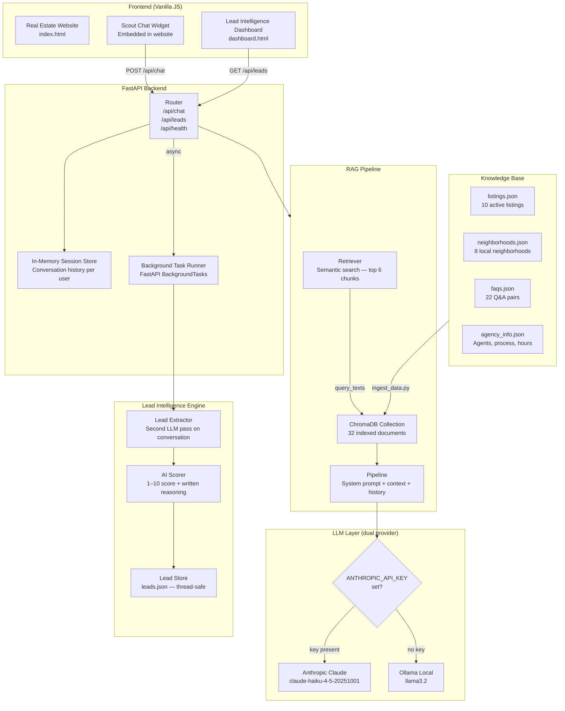
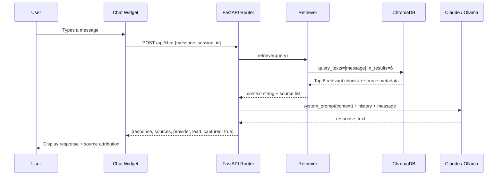
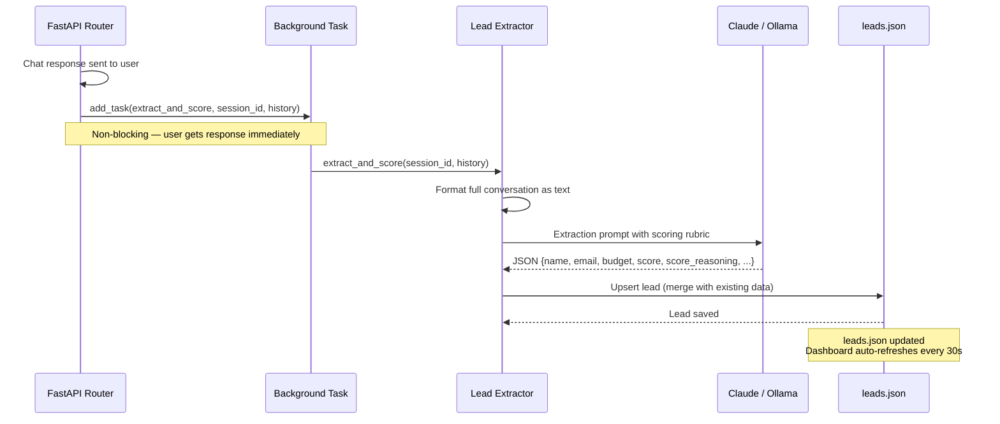
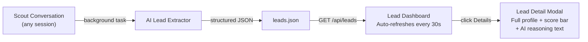
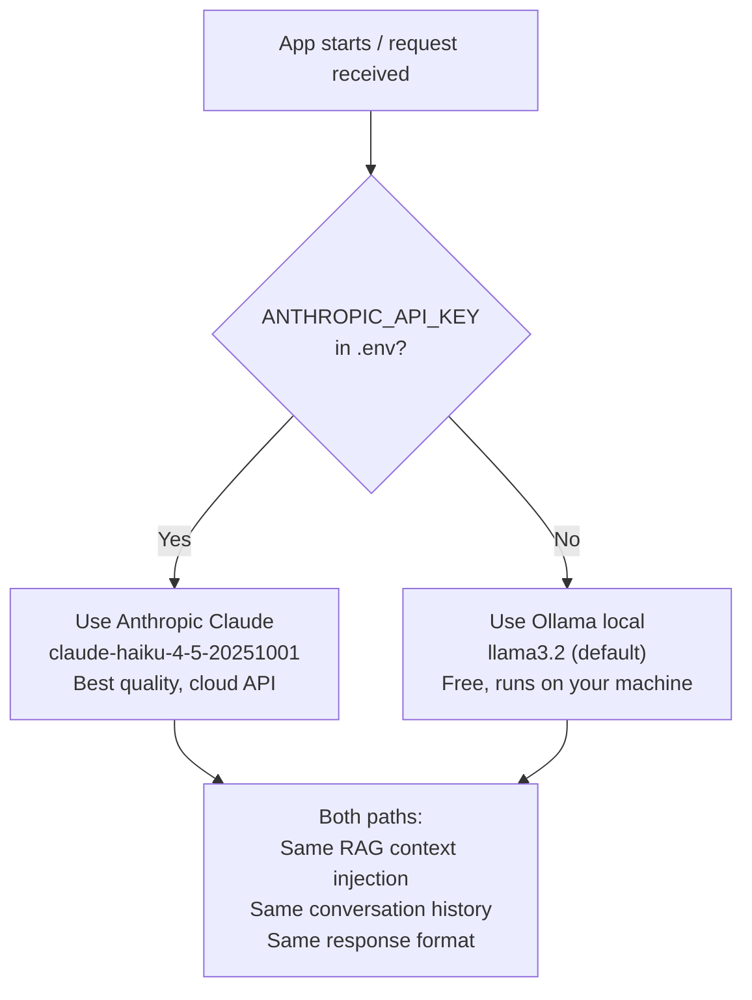

# Rappahannock Realty Group — Scout AI Lead Qualifier

> **Demo 2** of the AI Automation Portfolio by [Rappahannock Realty Group](https://rappahannockrg.com) — a local real estate consultancy serving the Fredericksburg, Stafford, and Spotsylvania, Virginia corridor.

A production-quality AI real estate assistant that **qualifies leads automatically**. Every conversation Scout has is silently analyzed by a second AI pass that extracts the buyer's budget, timeline, neighborhoods, and motivation — then scores the lead 1–10 with written reasoning. Agents open the dashboard and know who to call first.

---

## What Makes This Different

Most real estate chatbots answer questions. Scout does two things at once:

1. **Guides the visitor** — answers market questions, compares neighborhoods, explains financing, and gently uncovers what the buyer actually needs
2. **Qualifies the lead** — in the background, a second LLM call reads the full conversation and extracts structured data: budget, timeline, bedroom count, military status, investment intent, and contact info. Then it scores the lead and writes a human-readable explanation of why

The result is a live **Lead Intelligence Dashboard** — a mini-CRM that updates in real time, sortable by score, with full lead profiles and AI-written summaries.

---

## Live Demo Pages

| URL | Description |
|-----|-------------|
| `http://localhost:8090/` | Real estate website with embedded Scout chat widget |
| `http://localhost:8090/dashboard` | Lead Intelligence Dashboard (mini-CRM) |
| `http://localhost:8090/api/health` | API health check |
| `http://localhost:8090/api/leads` | Raw leads JSON |

---

## Tech Stack

| Layer | Technology | Purpose |
|-------|-----------|---------|
| **Backend** | FastAPI + Uvicorn | Async REST API, background tasks, static file serving |
| **LLM (cloud)** | Anthropic Claude (Haiku) | Chat responses + lead extraction |
| **LLM (local)** | Ollama (`llama3.2`) | Free fallback when no API key is set |
| **Vector DB** | ChromaDB (local, persistent) | Semantic search over listings, neighborhoods, FAQs |
| **Embeddings** | `sentence-transformers/all-MiniLM-L6-v2` | Local embedding model, no API key needed |
| **Config** | pydantic-settings | Type-safe `.env` management |
| **Lead Storage** | JSON file (thread-safe) | Persistent lead records, zero infrastructure |
| **Frontend** | Vanilla HTML/CSS/JS | No framework dependency, fully embeddable |
| **AI Framework** | Anthropic Python SDK | Direct API calls with conversation history |

---

## System Architecture



---

## RAG Pipeline — How Answers Are Generated



The system prompt instructs Scout to:
- Answer only with retrieved context (no hallucination)
- Sound like a knowledgeable local person, not a chatbot
- Naturally weave in one qualifying question per turn
- Redirect off-topic questions warmly back to real estate

---

## Lead Intelligence Pipeline — How Leads Are Scored



**Scoring rubric the LLM uses:**

| Score | Meaning |
|-------|---------|
| 9–10 | Pre-approved, timeline under 3 months, knows target neighborhoods — ready now |
| 7–8 | Has budget + timeline, actively searching, specific preferences stated |
| 5–6 | Actively engaged, detailed questions, budget implied, 3–6 month timeline |
| 3–4 | Browsing, exploring the market, no timeline or budget yet |
| 1–2 | Very early stage, vague questions, no qualifying information |

---

## Lead Dashboard — Data Flow



The dashboard shows for each lead:
- **AI score badge** (color-coded: red = hot, gold = warm, green = early)
- **Score reasoning snippet** — first 90 characters of the AI's written explanation
- **Conversation summary** — one sentence Scout wrote about what the lead wants
- **Structured profile** — budget range, bedroom count, target neighborhoods, tags
- **Detail modal** — full score reasoning, score progress bar, complete field-by-field profile

---

## LLM Provider Selection



Embeddings always run locally via `sentence-transformers` — **no API key needed** regardless of which LLM you use.

---

## Knowledge Base

The assistant's knowledge is split into four JSON files, ingested into ChromaDB at startup:

```
data/
├── listings.json          10 active property listings with full details
│                          (price, beds/baths, sqft, HOA, schools, features)
├── neighborhoods.json      8 local neighborhoods with deep local insight
│                          (commute times, price ranges, best-fit buyer types)
├── faqs.json              22 Q&A pairs across 6 categories
│                          (buying, selling, market, military, investment, neighborhoods)
└── agency_info.json       Agency overview, 3 agent profiles, buyer/seller process
```

**Ingest pipeline:** `scripts/ingest_data.py` builds 32 documents from these files, generates embeddings locally, and stores them in ChromaDB. Idempotent — re-running clears and rebuilds cleanly.

---

## Project Structure

```
rappahannock_realty/
├── app/
│   ├── main.py              FastAPI app — CORS, static files, route registration
│   ├── router.py            /api/chat, /api/leads, /api/health, /api/session/:id
│   ├── config.py            pydantic-settings — reads .env with absolute path resolution
│   ├── models.py            Pydantic schemas: ChatRequest, ChatResponse, Lead, LeadListResponse
│   ├── lead_store.py        Thread-safe JSON persistence for Lead objects
│   └── rag/
│       ├── embedder.py      ChromaDB singleton + SentenceTransformer embedding function
│       ├── retriever.py     Top-k semantic search → (context_string, sources)
│       ├── pipeline.py      System prompt + RAG context + LLM dispatch (Claude / Ollama)
│       └── lead_extractor.py  Background AI pass → structured lead + 1-10 score
├── data/
│   ├── listings.json
│   ├── neighborhoods.json
│   ├── faqs.json
│   └── agency_info.json
├── frontend/
│   ├── index.html           Real estate website with embedded Scout chat widget
│   └── dashboard.html       Lead Intelligence Dashboard (mini-CRM)
├── scripts/
│   └── ingest_data.py       One-time ChromaDB indexing script
├── requirements.txt
├── .env.example
└── .gitignore
```

---

## Quick Start

### 1. Clone and install

```bash
git clone https://github.com/akabonge/realestate.git
cd realestate
pip install -r requirements.txt
```

### 2. Configure environment

```bash
cp .env.example .env
# Edit .env — paste your ANTHROPIC_API_KEY, or leave blank to use Ollama
```

**Using Ollama (free, local)?** Make sure Ollama is running and `llama3.2` is pulled:
```bash
ollama pull llama3.2
ollama serve
```

### 3. Index the knowledge base

```bash
python scripts/ingest_data.py
```

This runs once (or whenever you update the data files). Downloads the embedding model on first run (~90MB).

```
Connecting to ChromaDB...
Prepared 32 documents.
Generating embeddings and storing...
Done. 32 documents indexed.
```

### 4. Start the server

```bash
uvicorn app.main:app --reload --port 8090
```

| Page | URL |
|------|-----|
| Real estate website + Scout chat | http://localhost:8090 |
| Lead Intelligence Dashboard | http://localhost:8090/dashboard |
| API health check | http://localhost:8090/api/health |

---

## API Reference

### `POST /api/chat`

Send a message, get a response. Lead extraction runs in the background automatically.

```json
{
  "message": "I'm looking for a 4-bedroom home near Quantico, budget around $550k",
  "session_id": "user_abc123"
}
```

**Response:**
```json
{
  "response": "Great — Stafford County is where most families near Quantico land...",
  "sources": ["neighborhoods/Embrey Mill", "listings/Stafford County", "faqs/Military"],
  "session_id": "user_abc123",
  "provider": "claude",
  "lead_captured": true
}
```

### `GET /api/leads`

Returns all AI-qualified leads.

```json
{
  "total": 3,
  "leads": [
    {
      "session_id": "user_abc123",
      "captured_at": "2026-05-27T23:10:38Z",
      "name": null,
      "email": null,
      "budget_min": 500000,
      "budget_max": 550000,
      "bedrooms": 4,
      "neighborhoods": ["Embrey Mill", "Stafford Lakes"],
      "is_military": true,
      "score": 7,
      "score_reasoning": "Military buyer with specific budget and neighborhood preferences...",
      "conversation_summary": "Military family relocating near Quantico, $550k budget, 4-5 bedrooms."
    }
  ]
}
```

### `GET /api/health`

```json
{
  "status": "ok",
  "provider": "claude",
  "model": "claude-haiku-4-5-20251001",
  "documents_indexed": 32,
  "active_sessions": 2
}
```

### `DELETE /api/session/{session_id}`

Clears conversation history for a session.

---

## Environment Variables

| Variable | Default | Description |
|----------|---------|-------------|
| `ANTHROPIC_API_KEY` | _(empty)_ | Claude API key. If blank, Ollama is used instead |
| `ANTHROPIC_MODEL` | `claude-haiku-4-5-20251001` | Claude model ID |
| `OLLAMA_MODEL` | `llama3.2` | Local Ollama model name |
| `OLLAMA_BASE_URL` | `http://localhost:11434` | Ollama server URL |
| `CHROMA_PERSIST_PATH` | `./chroma_store` | ChromaDB storage directory |
| `EMBEDDING_MODEL` | `all-MiniLM-L6-v2` | sentence-transformers model |
| `MAX_RETRIEVED_CHUNKS` | `6` | Number of context chunks per query |
| `MAX_HISTORY_MESSAGES` | `12` | Messages to retain per session |
| `LEADS_FILE` | `./leads.json` | Lead storage file path |

---

## How the Dual-Provider Pattern Works

```python
# app/rag/pipeline.py

def generate_response(query, history):
    context, sources = retrieve(query)          # always local embeddings
    system = SYSTEM_PROMPT.format(context=context)

    if settings.anthropic_api_key:
        return _call_claude(system, query, history, settings), sources, "claude"
    return _call_ollama(system, query, history, settings), sources, "ollama"
```

The same system prompt, context, and history are passed to both providers — swapping LLMs requires zero application logic changes.

---

## Key Design Decisions

**Why background tasks for lead extraction?**
The user gets their chat response in ~1 second. The lead extraction (a second LLM call) takes another 2–4 seconds. Running it in the background via FastAPI's `BackgroundTasks` means the user experience is never affected.

**Why JSON file storage instead of a database?**
This is a demo — zero infrastructure setup. The lead store is thread-safe via a Python lock and handles all realistic demo traffic. Swapping to PostgreSQL or Supabase would be a 30-minute change to `lead_store.py`.

**Why local embeddings?**
`all-MiniLM-L6-v2` runs entirely on CPU, generates embeddings in milliseconds, and requires no API key. This keeps the RAG pipeline free to operate regardless of which LLM you choose.

**Why ChromaDB?**
Persistent local vector database with no server process required. The collection loads at startup and queries return in under 50ms for this dataset size.

**Why absolute `.env` path resolution?**
```python
_ENV_FILE = Path(__file__).parent.parent / ".env"
```
`uvicorn --reload` changes the working directory in its subprocess. Using the config file's own location as an anchor means `.env` is always found regardless of where you launch the server from.

---

## Service Areas

The knowledge base covers the **Fredericksburg, Virginia metropolitan area**, including:

- **Fredericksburg City** — Historic downtown, Amtrak/VRE access, walkable neighborhoods
- **Stafford County** — Embrey Mill, Aquia Harbour, Leeland Station, North Stafford
- **Spotsylvania County** — Celebrate Virginia, Rappahannock Landing, Fawn Lake, Chancellor
- **Lake Anna** — Waterfront vacation homes and short-term rental investment properties
- **Military corridor** — Quantico, Fort Gregg-Adams, Dahlgren relocation expertise

---

## Part of the AI Automation Portfolio

This project is **Demo 2** in an ongoing portfolio of AI automation tools for local businesses in the Fredericksburg/Stafford/Spotsylvania region.

| Demo | Business Type | Key Feature |
|------|--------------|-------------|
| Demo 1 | Restaurant (Casa Alo's Bistro) | RAG chatbot with dual LLM support |
| **Demo 2** | **Real Estate (Rappahannock Realty Group)** | **AI lead scoring + Lead Intelligence Dashboard** |
| Demo 3 | _(coming soon)_ | _(coming soon)_ |

---

## Built With

- [FastAPI](https://fastapi.tiangolo.com/) — Modern async Python web framework
- [Anthropic Claude](https://www.anthropic.com/) — State-of-the-art LLM
- [Ollama](https://ollama.com/) — Run LLMs locally
- [ChromaDB](https://www.trychroma.com/) — Open-source vector database
- [sentence-transformers](https://www.sbert.net/) — Local semantic embeddings
- [pydantic-settings](https://docs.pydantic.dev/latest/concepts/pydantic_settings/) — Settings management

---

*Built by Aloysious Kabonge — AI Automation for local businesses in the Rappahannock region.*
